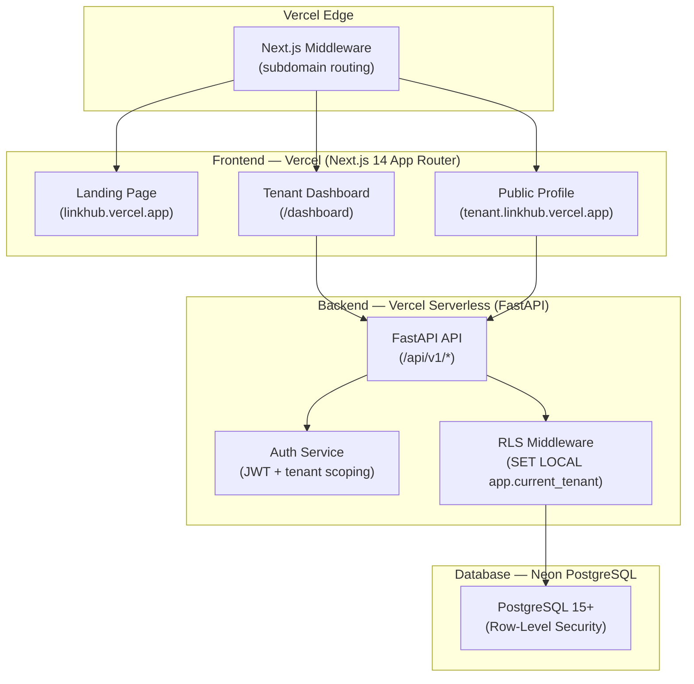
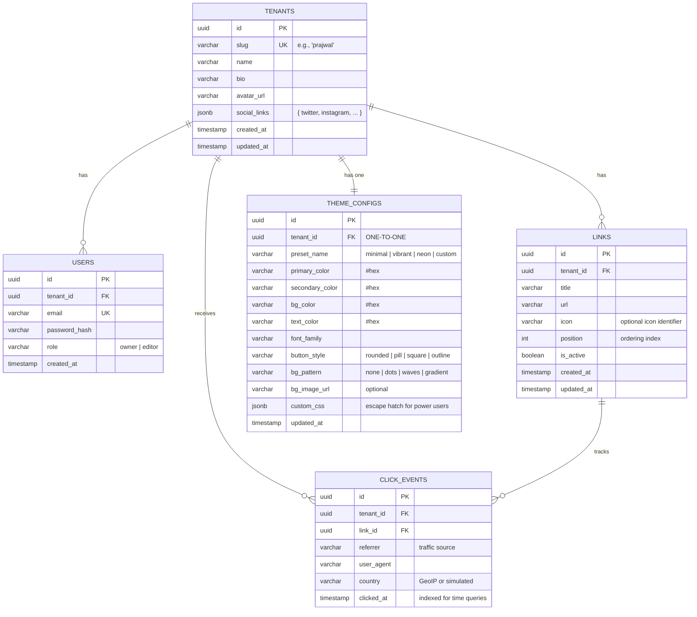

# LinkHub — Multi-Tenant "Link in Bio" Platform

> **Goal**: Build a production-grade, white-label "Link in Bio" platform with true multi-tenant isolation, deployed on Vercel.

---

## 1. Architecture Overview



### Key Decisions

| Decision | Choice | Rationale |
|---|---|---|
| **Frontend** | Next.js 14 (App Router) + TypeScript | SSR for public profiles (SEO), RSC for dashboard |
| **Backend** | FastAPI (Python 3.10) | Strong typing, auto OpenAPI docs, async support |
| **Database** | PostgreSQL (Neon) | Required for RLS; Neon offers serverless PG on Vercel |
| **Auth** | Custom JWT (jose + passlib) | Full control over tenant-scoped claims |
| **Drag & Drop** | @dnd-kit/core | Accessible, performant, tree-shakeable |
| **Charts** | Recharts | React-native, composable, well-maintained |
| **Styling** | CSS Modules + CSS Variables | Dynamic theming via CSS custom properties |
| **Deployment** | Vercel (monorepo) | Single deploy for both frontend + backend |

---

## 2. User Review Required

> [!IMPORTANT]
> **Deployment Target**: This plan uses **Vercel** for both frontend (Next.js) and backend (FastAPI as Serverless Functions). The FastAPI backend will be deployed as Vercel Serverless Python Functions under the `/api/` route. This means:
> - Backend is **stateless** (no in-memory state between requests)
> - Max execution time of ~10s per function (Vercel Hobby) or ~60s (Pro)
> - Database must be externally hosted (we'll use **Neon PostgreSQL** — Vercel's native Postgres partner)

> [!WARNING]
> **Subdomain Routing**: Full wildcard subdomains (`*.linkhub.vercel.app`) require a **custom domain** on Vercel. During development, we'll use path-based routing (`/site/[slug]`) as a fallback. The middleware is written to support both modes seamlessly.

> [!IMPORTANT]
> **Database Provider**: We need a cloud PostgreSQL instance. Options:
> 1. **Neon** (recommended — free tier, native Vercel integration, serverless-friendly)
> 2. **Supabase** (alternative — has its own auth, but we're building custom)
> 3. **Local Docker** for dev, cloud for prod
>
> **Please confirm your preferred database provider.**

---

## 3. Repository Structure

```
VIBE-CODER_PRAJWAL_APRIL_ASSESSMENT/
├── Frontend/                          # Next.js 14 App Router
│   ├── public/
│   │   ├── fonts/                     # Self-hosted Inter, Outfit fonts
│   │   ├── images/                    # Static assets
│   │   └── favicon.ico
│   ├── src/
│   │   ├── app/
│   │   │   ├── (marketing)/           # Landing page route group
│   │   │   │   ├── page.tsx           # Landing page
│   │   │   │   └── layout.tsx
│   │   │   ├── (auth)/                # Auth route group
│   │   │   │   ├── login/page.tsx
│   │   │   │   ├── register/page.tsx
│   │   │   │   └── layout.tsx
│   │   │   ├── dashboard/             # Tenant dashboard (protected)
│   │   │   │   ├── page.tsx           # Overview / link management
│   │   │   │   ├── analytics/page.tsx # Analytics dashboard
│   │   │   │   ├── settings/page.tsx  # Theme + profile settings
│   │   │   │   ├── appearance/page.tsx# Theme customization
│   │   │   │   └── layout.tsx         # Dashboard shell with sidebar
│   │   │   ├── site/
│   │   │   │   └── [slug]/            # Public tenant profile (path-based)
│   │   │   │       └── page.tsx
│   │   │   ├── layout.tsx             # Root layout
│   │   │   ├── globals.css            # Global styles + CSS variables
│   │   │   └── not-found.tsx
│   │   ├── components/
│   │   │   ├── ui/                    # Reusable UI primitives
│   │   │   │   ├── Button.tsx
│   │   │   │   ├── Card.tsx
│   │   │   │   ├── Input.tsx
│   │   │   │   ├── Modal.tsx
│   │   │   │   ├── Avatar.tsx
│   │   │   │   ├── Badge.tsx
│   │   │   │   ├── Skeleton.tsx       # Loading skeletons
│   │   │   │   └── Toast.tsx
│   │   │   ├── dashboard/
│   │   │   │   ├── Sidebar.tsx
│   │   │   │   ├── LinkCard.tsx       # Draggable link item
│   │   │   │   ├── LinkEditor.tsx     # Add/edit link modal
│   │   │   │   ├── LinkList.tsx       # Drag-and-drop container
│   │   │   │   ├── ThemePreview.tsx   # Live theme preview panel
│   │   │   │   ├── ThemeControls.tsx  # Color pickers, font selectors
│   │   │   │   └── StatsCard.tsx
│   │   │   ├── analytics/
│   │   │   │   ├── ClickHeatmap.tsx   # 24-hour click visualization
│   │   │   │   ├── LinkRanking.tsx    # Top performing links
│   │   │   │   ├── TrafficSources.tsx # Referrer breakdown
│   │   │   │   └── DateRangePicker.tsx
│   │   │   ├── profile/               # Public profile components
│   │   │   │   ├── ProfileHeader.tsx
│   │   │   │   ├── LinkButton.tsx     # Themed link button
│   │   │   │   ├── SocialIcons.tsx
│   │   │   │   └── ProfileFooter.tsx
│   │   │   └── shared/
│   │   │       ├── Navbar.tsx
│   │   │       ├── Footer.tsx
│   │   │       └── EmptyState.tsx     # Onboarding empty states
│   │   ├── hooks/
│   │   │   ├── useAuth.ts
│   │   │   ├── useLinks.ts
│   │   │   ├── useTheme.ts
│   │   │   ├── useAnalytics.ts
│   │   │   └── useDragAndDrop.ts
│   │   ├── lib/
│   │   │   ├── api.ts                 # API client (fetch wrapper)
│   │   │   ├── auth.ts                # JWT decode, token storage
│   │   │   ├── constants.ts
│   │   │   ├── utils.ts
│   │   │   └── themes.ts             # Preset theme definitions
│   │   ├── types/
│   │   │   ├── api.ts                 # API response types
│   │   │   ├── tenant.ts
│   │   │   ├── link.ts
│   │   │   ├── analytics.ts
│   │   │   └── theme.ts
│   │   ├── styles/
│   │   │   ├── variables.css          # Design tokens
│   │   │   ├── animations.css         # Keyframe definitions
│   │   │   └── themes/
│   │   │       ├── minimal.css
│   │   │       ├── vibrant.css
│   │   │       └── neon.css
│   │   └── middleware.ts              # Subdomain → path rewriting
│   ├── next.config.js
│   ├── tsconfig.json
│   ├── package.json
│   └── .env.local.example
│
├── Backend/                           # FastAPI (Python 3.10)
│   ├── api/
│   │   └── index.py                   # Vercel serverless entry point
│   ├── app/
│   │   ├── __init__.py
│   │   ├── main.py                    # FastAPI app factory
│   │   ├── config.py                  # Settings (pydantic-settings)
│   │   ├── database.py                # Async SQLAlchemy engine + session
│   │   ├── dependencies.py            # Shared FastAPI dependencies
│   │   ├── routers/
│   │   │   ├── __init__.py
│   │   │   ├── auth.py                # POST /register, /login, /refresh
│   │   │   ├── tenants.py             # GET/PUT /tenant (profile)
│   │   │   ├── links.py               # CRUD + reorder links
│   │   │   ├── analytics.py           # GET analytics data
│   │   │   ├── themes.py              # GET/PUT theme config
│   │   │   └── public.py              # GET /public/{slug} (unauthenticated)
│   │   ├── models/
│   │   │   ├── __init__.py
│   │   │   ├── tenant.py              # Tenant SQLAlchemy model
│   │   │   ├── user.py                # User model (belongs to tenant)
│   │   │   ├── link.py                # Link model
│   │   │   ├── click_event.py         # Click analytics model
│   │   │   └── theme.py               # Theme configuration model
│   │   ├── schemas/
│   │   │   ├── __init__.py
│   │   │   ├── auth.py                # Pydantic request/response schemas
│   │   │   ├── tenant.py
│   │   │   ├── link.py
│   │   │   ├── analytics.py
│   │   │   └── theme.py
│   │   ├── services/
│   │   │   ├── __init__.py
│   │   │   ├── auth_service.py        # Password hashing, JWT creation
│   │   │   ├── tenant_service.py
│   │   │   ├── link_service.py
│   │   │   ├── analytics_service.py   # Click recording + aggregation
│   │   │   └── theme_service.py
│   │   ├── middleware/
│   │   │   ├── __init__.py
│   │   │   ├── tenant_context.py      # SET LOCAL app.current_tenant
│   │   │   └── cors.py                # CORS configuration
│   │   ├── security/
│   │   │   ├── __init__.py
│   │   │   ├── jwt.py                 # JWT encode/decode with tenant claims
│   │   │   ├── password.py            # bcrypt hashing
│   │   │   └── permissions.py         # IDOR protection guards
│   │   └── utils/
│   │       ├── __init__.py
│   │       └── seed.py                # Mock data generator
│   ├── migrations/
│   │   ├── env.py                     # Alembic environment
│   │   ├── versions/
│   │   │   └── 001_initial_schema.py  # Initial migration
│   │   └── script.py.mako
│   ├── tests/
│   │   ├── __init__.py
│   │   ├── conftest.py
│   │   ├── test_auth.py
│   │   ├── test_links.py
│   │   ├── test_tenant_isolation.py   # Cross-tenant access tests
│   │   └── test_analytics.py
│   ├── alembic.ini
│   ├── requirements.txt
│   ├── .env.example
│   └── Dockerfile                     # For local dev with Docker Compose
│
├── vercel.json                        # Vercel monorepo routing config
├── docker-compose.yml                 # Local dev: PostgreSQL + Backend
├── .gitignore
├── .env.example                       # Root-level env template
├── README.md
├── FILESYSTEM.md                      # ← Live filesystem tracker (this doc)
├── challenge.txt                      # Original challenge spec
└── placeholder.txt
```

---

## 4. Database Schema Design



### Row-Level Security (RLS) Policies

```sql
-- Enable RLS on all tenant-scoped tables
ALTER TABLE users ENABLE ROW LEVEL SECURITY;
ALTER TABLE links ENABLE ROW LEVEL SECURITY;
ALTER TABLE theme_configs ENABLE ROW LEVEL SECURITY;
ALTER TABLE click_events ENABLE ROW LEVEL SECURITY;

-- Force RLS even for table owner
ALTER TABLE users FORCE ROW LEVEL SECURITY;
ALTER TABLE links FORCE ROW LEVEL SECURITY;
ALTER TABLE theme_configs FORCE ROW LEVEL SECURITY;
ALTER TABLE click_events FORCE ROW LEVEL SECURITY;

-- Policy: Users can only see/modify their own tenant's data
CREATE POLICY tenant_isolation ON users
    USING (tenant_id = current_setting('app.current_tenant')::uuid)
    WITH CHECK (tenant_id = current_setting('app.current_tenant')::uuid);

-- Repeat for links, theme_configs, click_events
-- (same pattern, applied per-table)
```

---

## 5. API Design

### Authentication Endpoints

| Method | Endpoint | Description | Auth |
|---|---|---|---|
| `POST` | `/api/v1/auth/register` | Create tenant + owner user | Public |
| `POST` | `/api/v1/auth/login` | Issue JWT with `tenant_id` claim | Public |
| `POST` | `/api/v1/auth/refresh` | Refresh access token | Bearer |

### Tenant Endpoints

| Method | Endpoint | Description | Auth |
|---|---|---|---|
| `GET` | `/api/v1/tenant` | Get current tenant profile | Bearer |
| `PUT` | `/api/v1/tenant` | Update tenant profile | Bearer |
| `GET` | `/api/v1/public/{slug}` | Get public profile + links + theme | Public |

### Link Endpoints

| Method | Endpoint | Description | Auth |
|---|---|---|---|
| `GET` | `/api/v1/links` | List all links (ordered) | Bearer |
| `POST` | `/api/v1/links` | Create new link | Bearer |
| `PUT` | `/api/v1/links/{id}` | Update link | Bearer |
| `DELETE` | `/api/v1/links/{id}` | Soft-delete link | Bearer |
| `PUT` | `/api/v1/links/reorder` | Batch update positions | Bearer |

### Analytics Endpoints

| Method | Endpoint | Description | Auth |
|---|---|---|---|
| `POST` | `/api/v1/analytics/click` | Record a click event | Public |
| `GET` | `/api/v1/analytics/overview` | Total clicks, top links | Bearer |
| `GET` | `/api/v1/analytics/heatmap` | 24-hour click distribution | Bearer |
| `GET` | `/api/v1/analytics/sources` | Referrer breakdown | Bearer |

### Theme Endpoints

| Method | Endpoint | Description | Auth |
|---|---|---|---|
| `GET` | `/api/v1/theme` | Get current theme config | Bearer |
| `PUT` | `/api/v1/theme` | Update theme config | Bearer |
| `GET` | `/api/v1/theme/presets` | List available presets | Public |

---

## 6. Phased Execution Plan

### Phase 1 — Project Scaffolding & Infrastructure
> **Sprint 1** · Foundation

- [ ] Initialize monorepo structure (`Frontend/`, `Backend/`)
- [ ] Scaffold Next.js 14 App Router project in `Frontend/`
- [ ] Scaffold FastAPI project in `Backend/`
- [ ] Configure `vercel.json` for monorepo routing
- [ ] Set up `docker-compose.yml` for local PostgreSQL
- [ ] Configure ESLint, Prettier, Git hooks
- [ ] Create `.env.example` files for both services
- [ ] Initialize Git and push to remote

---

### Phase 2 — Backend Core (Auth + Data Layer)
> **Sprint 2** · Secure Foundation

- [ ] Define SQLAlchemy models (Tenant, User, Link, ThemeConfig, ClickEvent)
- [ ] Set up Alembic migrations
- [ ] Implement RLS policies via migration
- [ ] Build `tenant_context` middleware (SET LOCAL per request)
- [ ] Implement JWT auth (register, login, refresh)
- [ ] Build tenant CRUD endpoints
- [ ] Build link CRUD + reorder endpoints
- [ ] Write IDOR protection tests
- [ ] Write cross-tenant isolation tests
- [ ] Seed mock data (3 distinct tenants with links)

---

### Phase 3 — Frontend Core (Dashboard + Auth)
> **Sprint 3** · Tenant Dashboard

- [ ] Build design system (CSS variables, UI primitives)
- [ ] Implement auth flow (login, register pages)
- [ ] Build dashboard layout (sidebar, header)
- [ ] Build link management UI with @dnd-kit drag-and-drop
- [ ] Build link add/edit modal
- [ ] Connect dashboard to backend API
- [ ] Implement loading states, skeletons, empty states
- [ ] Add toast notifications

---

### Phase 4 — Theming Engine + Public Profiles
> **Sprint 4** · The "Wow" Factor

- [ ] Build theme configuration UI (color pickers, font selectors, presets)
- [ ] Implement CSS variable injection from API response
- [ ] Build 3 distinct preset themes (Minimal, Vibrant, Neon)
- [ ] Build public profile page with dynamic theming
- [ ] Implement Next.js middleware for subdomain routing
- [ ] Add micro-interactions (hover, transitions, loading animations)
- [ ] Mobile-first responsive design pass
- [ ] Capture screenshots of 3 themes (deliverable requirement)

---

### Phase 5 — Analytics Dashboard
> **Sprint 5** · Data Visualization

- [ ] Build click event recording (on public profile link clicks)
- [ ] Implement analytics aggregation queries
- [ ] Build 24-hour click heatmap (Recharts)
- [ ] Build link performance ranking chart
- [ ] Build traffic source breakdown chart
- [ ] Add date range filtering
- [ ] Generate realistic mock analytics data

---

### Phase 6 — Polish, Testing, Deployment
> **Sprint 6** · Ship It

- [ ] End-to-end testing (auth → dashboard → public profile)
- [ ] Performance optimization (lazy loading, code splitting)
- [ ] SEO optimization for public profiles
- [ ] Deploy to Vercel (connect repo, configure env vars)
- [ ] Configure custom domain + wildcard subdomain (if applicable)
- [ ] Final README.md with setup instructions
- [ ] Record demo video / capture deliverable screenshots

---

## 7. Command Flow

Below is the exact sequence of commands we'll execute. Each command will be proposed for your approval.

### Phase 1 Commands:

```bash
# 1. Initialize Next.js in Frontend/
npx -y create-next-app@latest ./Frontend --typescript --eslint --app --src-dir --import-alias "@/*" --no-tailwind --use-npm

# 2. Install frontend dependencies
cd Frontend && npm install @dnd-kit/core @dnd-kit/sortable @dnd-kit/utilities recharts jose react-hot-toast react-icons react-colorful

# 3. Create Backend directory structure
mkdir -p Backend/{api,app/{routers,models,schemas,services,middleware,security,utils},migrations/versions,tests}

# 4. Create Python virtual environment
cd Backend && python3.10 -m venv venv && source venv/bin/activate

# 5. Install backend dependencies
pip install fastapi uvicorn[standard] sqlalchemy[asyncio] asyncpg alembic pydantic-settings python-jose[cryptography] passlib[bcrypt] python-multipart httpx pytest pytest-asyncio

# 6. Freeze requirements
pip freeze > requirements.txt

# 7. Create vercel.json at root
# (file creation — not a shell command)

# 8. Create docker-compose.yml for local PostgreSQL
# (file creation — not a shell command)

# 9. Initialize Alembic
cd Backend && alembic init migrations

# 10. Git commit  
git add -A && git commit -m "chore: scaffold monorepo — Next.js frontend + FastAPI backend"
```

### Phase 2 Commands:

```bash
# 11. Run migrations
cd Backend && alembic revision --autogenerate -m "initial schema"
cd Backend && alembic upgrade head

# 12. Run backend tests
cd Backend && pytest tests/ -v

# 13. Start backend dev server (local)
cd Backend && uvicorn app.main:app --reload --port 8000

# 14. Seed mock data
cd Backend && python -m app.utils.seed
```

### Phase 3–6 Commands:

```bash
# 15. Start frontend dev server
cd Frontend && npm run dev

# 16. Run frontend type checks
cd Frontend && npx tsc --noEmit

# 17. Build for production (verification)
cd Frontend && npm run build

# 18. Deploy to Vercel
npx -y vercel --prod
```

---

## 8. Vercel Deployment Configuration

### `vercel.json` (Root)

```json
{
  "buildCommand": "cd Frontend && npm run build",
  "outputDirectory": "Frontend/.next",
  "installCommand": "cd Frontend && npm install",
  "framework": "nextjs",
  "rewrites": [
    { "source": "/api/v1/:path*", "destination": "/api/index" }
  ],
  "functions": {
    "api/index.py": {
      "runtime": "python3.10",
      "maxDuration": 30
    }
  }
}
```

> [!NOTE]
> The FastAPI backend is deployed as a single Vercel Serverless Function at `api/index.py`. All `/api/v1/*` requests are rewritten to this handler. The Next.js frontend is the primary framework.

---

## 9. Open Questions

> [!IMPORTANT]
> **1. Database Provider**: Which cloud PostgreSQL provider do you prefer?
> - **Neon** (recommended — free tier, native Vercel, serverless-optimized)
> - **Supabase** (free tier, built-in auth which we won't use)
> - **Other** (ElephantSQL, Railway, etc.)

> [!IMPORTANT]
> **2. Domain**: Do you have a custom domain for wildcard subdomains? If not, we'll use path-based routing (`linkhub.vercel.app/site/[slug]`) which works identically in the codebase — the middleware handles both modes.

> [!IMPORTANT]
> **3. Scope for V1**: Should we include ALL features in the first deployment, or would you prefer a staged rollout (e.g., dashboard first → analytics later)?

---

## 10. Verification Plan

### Automated Tests
- **Backend**: `pytest` — tenant isolation, IDOR protection, auth flows, link CRUD
- **Frontend**: `npx tsc --noEmit` — full type safety verification
- **Build**: `npm run build` — ensure zero build errors before deploy

### Manual Verification
- [ ] Register 3 different tenants
- [ ] Each tenant creates unique links and applies different themes
- [ ] Visit each tenant's public profile — confirm visual distinctness
- [ ] Attempt cross-tenant data access (verify 403/empty results)
- [ ] Test drag-and-drop on mobile viewport
- [ ] Screenshot 3 distinct themes as deliverable proof
- [ ] Verify analytics data populates after link clicks

### Browser Tests
- Navigate to public profiles with all 3 themes
- Test auth flow (register → login → dashboard)
- Test link CRUD (create, edit, delete, reorder)
- Test responsive layout at 375px, 768px, 1440px widths
